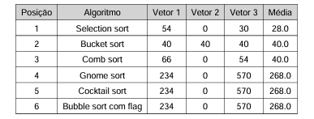
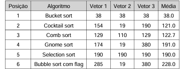

# TDE-3---Ordenacao

## Descrição

Este projeto tem como objetivo estudar e implementar diferentes algoritmos de ordenação e comparar seus desempenhos em termos de movimentações (trocas de elementos) e comparações (iterações realizadas em laços).
Os algoritmos analisados foram: Comb sort, Gnome sort, Bucket sort, Bubble sort com flag de parada, Selection sort e Cocktail sort.

Os testes foram realizados com três vetores distintos:

Vetor 1: valores aleatórios

Vetor 2: valores já ordenados

Vetor 3: valores decrescentes

## Instituição

PUCPR - Pontifícia Universidade Católica do Paraná

## Disciplina

Resolução de Problemas Estruturados em Computação

## Professor

Andrey Cabral Meira

## Aluna

Cecília Lucchesi Mardegan (usuário: ceciLcchM)

## Análise de Desempenho
### 1. Desempenho em movimentações:

O Selection sort foi o algoritmo que apresentou o menor número de movimentações, ele troca elementos apenas uma vez por iteração, isso o torna eficiente quando o objetivo é minimizar trocas. O Bucket sort e o Comb sort também obtiveram bom desempenho, ficando logo atrás com médias semelhantes. Já o Gnome sort, Cocktail sort e Bubble sort com flag realizaram muitas trocas, especialmente nos vetores desordenados, assim demonstrando menor eficiência.

Conclusão:
Melhor em movimentações: Selection sort

Consistentes: Bucket sort e Comb sort

Pior desempenho com mais trocas: Gnome, Cocktail e Bubble Sort

### 2. Desempenho em comparações:

O Bucket sort foi o mais eficiente em número de comparações, mantendo valores fixos em todos os testes. Isso indica que seu desempenho não depende da ordem inicial dos dados. Comb sort e Cocktail sort se destacaram, principalmente quando o vetor já estava ordenado, necessitando de poucas iterações. Selection sort e Bubble sort com flag foram os piores nesse quesito, pois continuam comparando elementos mesmo quando o vetor já está completamente ordenado.

Conclusão:
Melhor em comparações: Bucket Sort

Consistentes: Comb Sort e Cocktail Sort

Pior desempenho com mais comparações: Selection Sort e Bubble Sort

### 3. Comportamento por tipo de vetor:

Vetor 1 (aleatório): Selection sort se destacou nas trocas, Bucket sort nas comparações.

Vetor 2 (ordenado): Todos os algoritmos que detectam ordenação, como Comb sort, Cocktail sort e Bubble sort, obtiveram ótima performance.

Vetor 3 (inverso): Selection sort manteve poucas trocas e Bucket sort continuou constante.

### Resumo:

Os testes mostraram que o Selection sort é o algoritmo mais eficiente em termos de movimentações, trocando elementos apenas quando necessário, enquanto o Bucket sort teve o menor número de comparações, com desempenho estável em todos os vetores. O Comb sort e o Cocktail sort tiveram bom desempenho em vetores parcialmente ordenados. Já o Bubble sort com flag e o Gnome sort apresentaram desempenho inferior na maioria dos casos, principalmente nos vetores desordenados.
